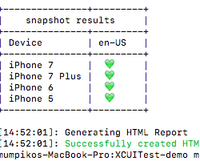
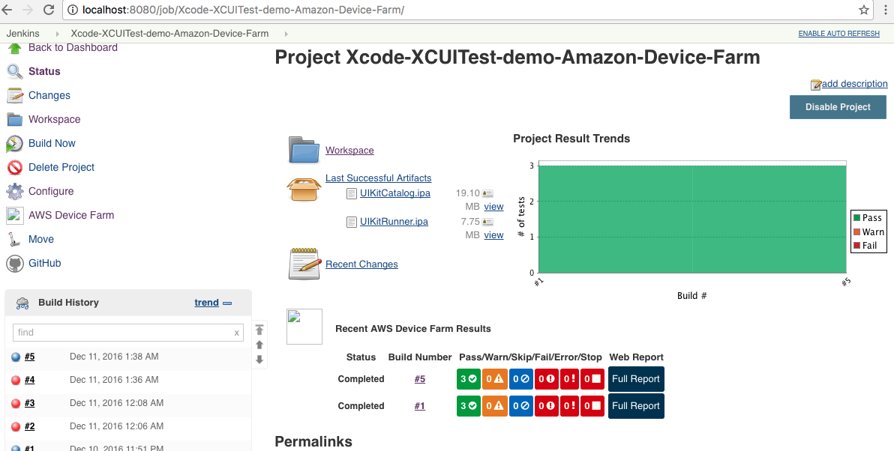
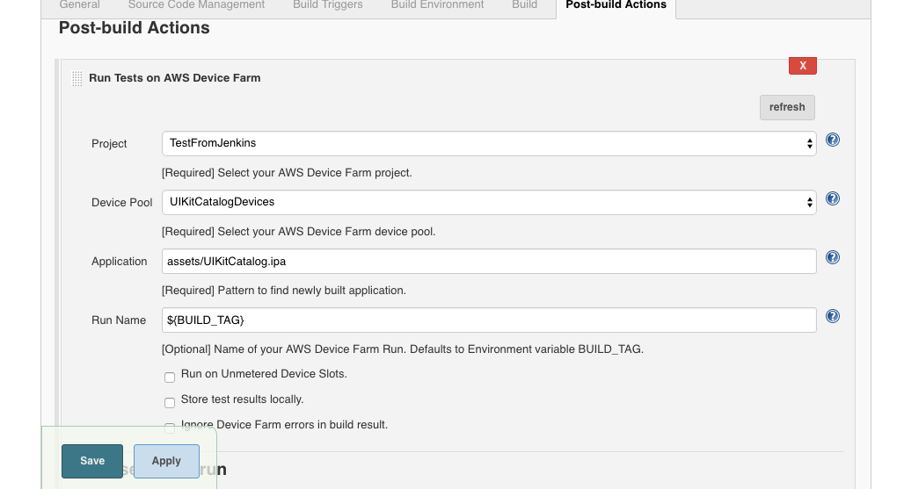
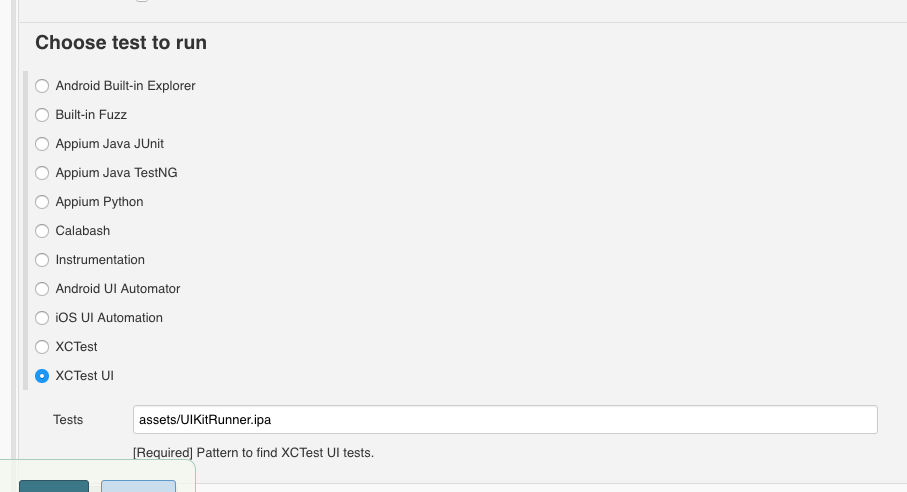
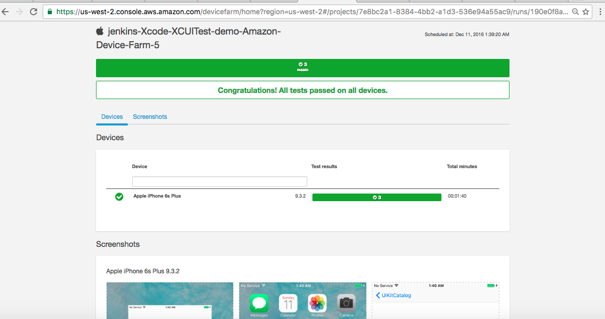

## What is Fastlane Snapshot

Snapshot generates localized iOS and tvOS screenshots for different device types and languages

## How to run the XCUITest test without Fastlane Snapshot

    xcodebuild -workspace UIKitCatalog.xcworkspace -scheme "UIKitCatalogUITests" -destination 'platform=iOS Simulator,name=iPhone 6,OS=10.1' -derivedDataPath './output' test

## How to run the XCUITest test with Fastlane Snapshot

    snapshot

or 

    snapshot --stop_after_first_err

## Output from my test execution

## Location of my HTML file with an overview of all the screenshots

    /Users/mk/dev/XCUITest/XCUITest-demo/screenshots/screenshots.html

## What is Amazon Device Farm

AWS Device Farm is an app testing service that lets you test and interact with your Android, iOS, and web apps on many devices at once

## My Jenkins execution against Amazon Device Farm

## My AWS Device Farm configurations on my local Jenkins

The ipa files can be passed to the test Jenkins job through the Jenkins' Copy Artifact Plugin. To see how to create Test Runner ipa, take a look at https://docs.aws.amazon.com/devicefarm/latest/developerguide/test-types-ios-xctest-ui.html.

## My web test report from AWS Device Farm

## About Test Runner .ipa required by AWS Device Farm

https://docs.aws.amazon.com/devicefarm/latest/developerguide/test-types-ios-xctest-ui.html

Before you upload iOS XCTest UI tests to Device Farm for testing, make sure that your iOS XCTest UI test runner bundle is contained within a properly formatted .ipa file. To create an .ipa file, you can place your my-project-nameUITest-Runner.app bundle in an empty Payload directory. Next, archive the Payload directory into a .zip file and then change the file extension to .ipa. The *UITest-Runner.app bundle is produced by Xcode when you build your project for testing, and it can be found in the Products directory for your project.

 
